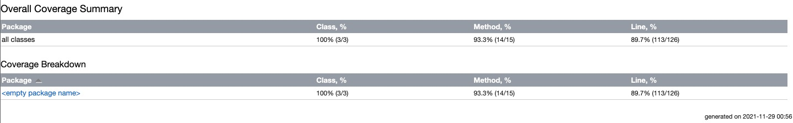

Zendesk Coding Competition - Sachin Malepati (sachin.malepati@gmail.com)

## Steps to execute the program

Step 1 : mvn compile 

Step 2: mvn install -Dmaven.test.skip=true

Step 3: mvn exec:java

## Junit coverage

test: mvn test

89% unit coverage achieved.

